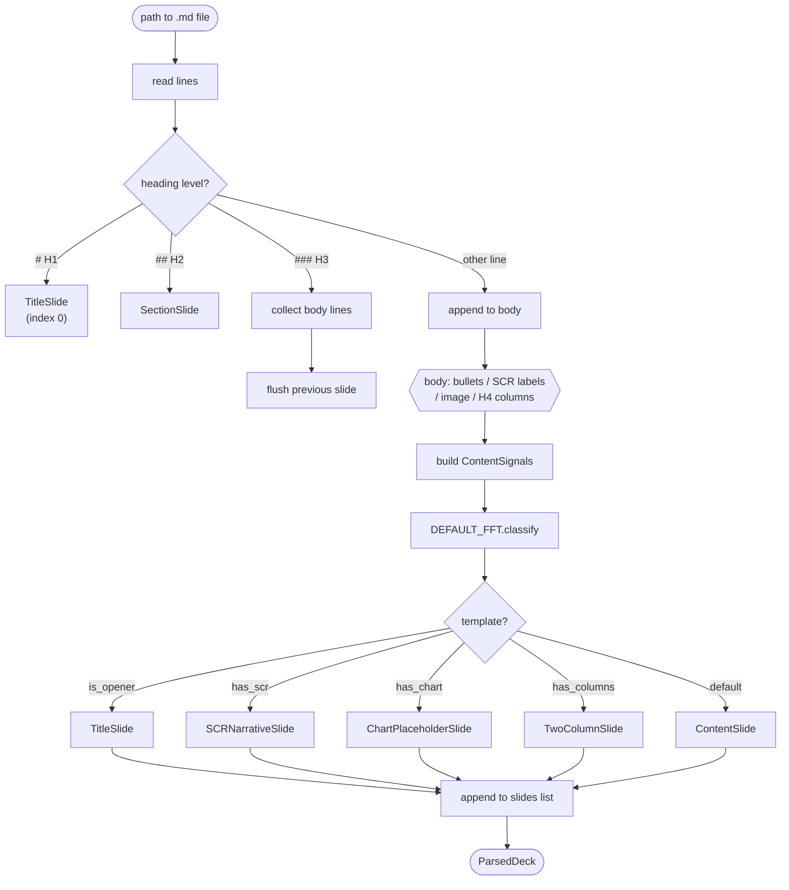
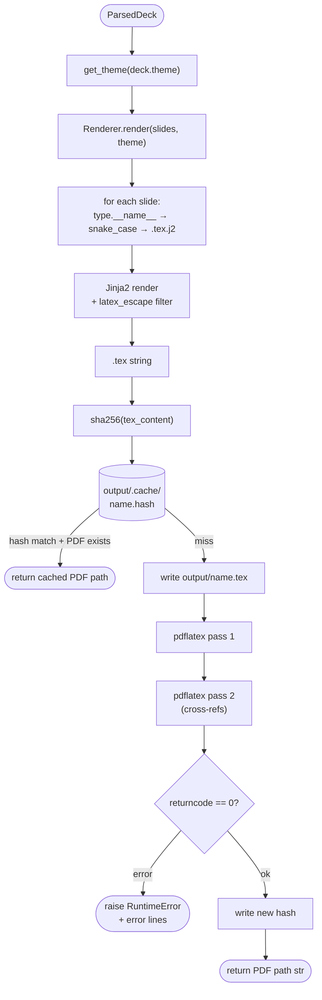

# slide-deck

Python library that converts Markdown files into LaTeX (Beamer) PDF slide decks.  
Write `.md` → get a consulting-quality PDF. No API key required.

---

## Quick start

```bash
uv add jinja2 click rich pydantic          # runtime deps
uv add --dev pytest ruff                   # dev deps
uv run main.py build examples/ml_monitoring.md
uv run main.py validate examples/ml_monitoring.md   # lint only
```

---

## How it works

### Pipeline overview

```mermaid
flowchart TD
    A(["deck.md file"]) --> B["parse(path)"]
    B -->|ParsedDeck| C["validate(deck)"]
    C -->|"list[str] warnings"| D["build(deck)"]
    D --> E(["output/deck.pdf"])

    subgraph inside parse
        P1["read lines"] --> P2["scan headings"]
        P2 --> P3["collect slide body"]
        P3 --> P4["FFT classify → typed slide"]
    end

    B -.-> inside parse

    subgraph inside build
        B1["get_theme"] --> B2["Renderer.render → .tex"]
        B2 --> B3["sha256 cache check"]
        B3 -->|"miss"| B4["pdflatex ×2"]
        B3 -->|"hit"| B5(["return cached PDF"])
        B4 --> B6(["return PDF path"])
    end

    D -.-> inside build
```

---

### 1. `parse(path)` — `slides/parser.py`

Reads a `.md` file line-by-line, maps headings to slide roles, and runs the FFT classifier on each slide body to produce fully-typed Pydantic slide objects.



**Output:** `ParsedDeck` — `title`, `author`, `theme`, `slides: list[Slide]` fully typed.

---

### 2. `validate(deck)` — `slides/api.py`

Runs the ghost-deck linter against MBB consulting standards. Never raises — always returns warnings as strings.


**Output:** `list[str]` — zero or more warning messages; empty list means deck passes.

---

### 3. `build(deck)` — `slides/api.py` + `slides/renderer.py` + `slides/compiler.py`

Renders typed slide objects to a LaTeX Beamer document, then compiles to PDF with a content-hash cache.



**Output:** `str` — absolute path to compiled PDF, e.g. `output/deck.pdf`.

---

### 4. FFT Template Classifier — `slides/selector.py`

Fast-and-Frugal Tree: checks one cue at a time, exits on first match. Most distinctive signals checked first.


**Output:** `str` — class name of the winning slide type.

---

## Markdown conventions

```markdown
# Deck Title                         ← TitleSlide
<!-- author: Name -->                ← metadata
<!-- theme: consulting -->           ← see Themes table for all 10 options

## Section Name                      ← SectionSlide

### Slide action title               ← ContentSlide (default)
- bullet one
> Source: IDC 2025

### SCR slide title
**Situation:** current state...      ← SCRNarrativeSlide (all 3 required)
**Complication:** the problem...
**Resolution:** recommendation...

### Chart slide title
    ← ChartPlaceholderSlide

### Two-column slide title           ← TwoColumnSlide (exactly 2 H4s)
#### Left Header
- left bullet
#### Right Header
- right bullet

<!-- notes: presenter note -->       ← notes on any slide
```

---

## Usage modes

### CLI

```bash
uv run main.py build deck.md
uv run main.py build deck.md --theme minimal --engine lualatex
uv run main.py validate deck.md
```

### Python / PydanticAI agent

```python
from slides.api import parse, validate, build

# Direct
deck = parse("deck.md")
warnings = validate(deck)
pdf_path = build(deck)

# One-shot
from slides.api import build_from_md
pdf_path = build_from_md("deck.md")

# PydanticAI tools
from pydantic_ai import Agent
from slides.api import parse, validate, build
from slides.model import ParsedDeck

agent = Agent("claude-sonnet-4-6", ...)

@agent.tool
def parse_markdown(ctx, md_path: str) -> ParsedDeck:
    return parse(md_path)

@agent.tool
def validate_deck(ctx, deck: ParsedDeck) -> list[str]:
    return validate(deck)

@agent.tool
def build_deck(ctx, deck: ParsedDeck) -> str:
    return build(deck)
```

---

## Testing

```bash
uv run pytest                          # all tests
uv run pytest tests/test_parser.py -v  # parser only
uv run pytest tests/test_selector.py   # FFT only
uv run pytest tests/test_api.py        # api only
uv run pytest tests/test_themes.py     # compile all 10 themes
```

83 tests total: selector (22), parser (28), api (22), themes (11).

---

## Themes

| Name | Audience | Primary | Accent |
|---|---|---|---|
| `consulting` | Strategy / MBB pitch | Navy `#003366` | Gold `#C9A84C` |
| `minimal` | Any — clean, no distraction | Black `#000000` | Gray `#555555` |
| `dark` | Tech / product demo | Dark navy `#1A1A2E` | Red `#E94560` |
| `startup` | VC / Series A–B pitch | Orange `#FF6B35` | Teal `#00D4AA` |
| `academic` | Research / university | Burgundy `#5C1A1A` | Warm gold `#8B6914` |
| `finance` | Banking / PE / hedge fund | Forest green `#1B4332` | Green `#52B788` |
| `tech` | Engineering / SaaS / cloud | Deep blue `#0F4C81` | Cyan `#00B4D8` |
| `government` | Public sector / policy | Dark navy `#1C2B4A` | Flag red `#C0392B` |
| `healthcare` | Medical / pharma / clinical | Medical blue `#005B96` | Light blue `#48CAE4` |
| `creative` | Agency / design / media | Purple `#6A0572` | Gold `#FFB703` |
