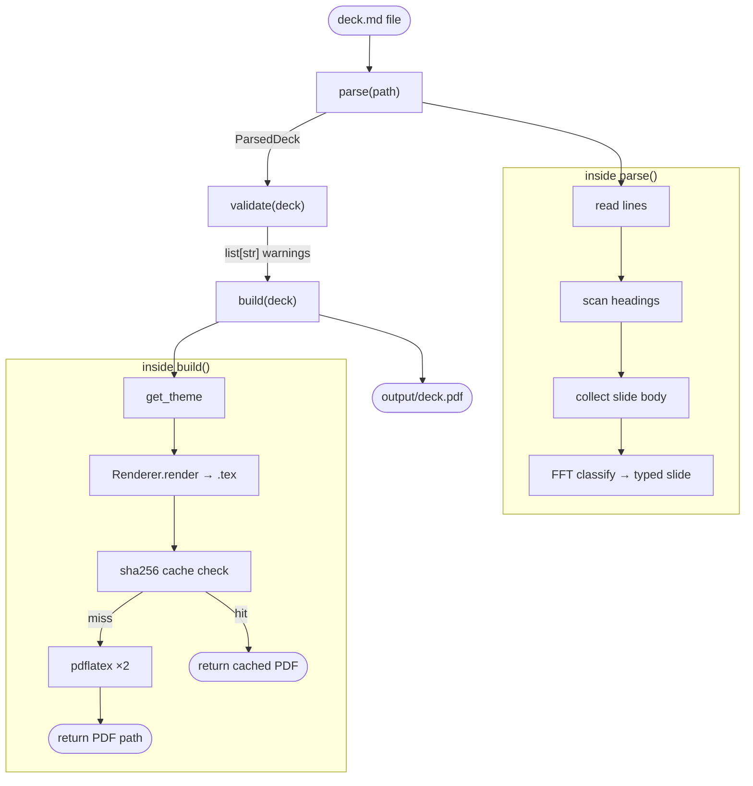
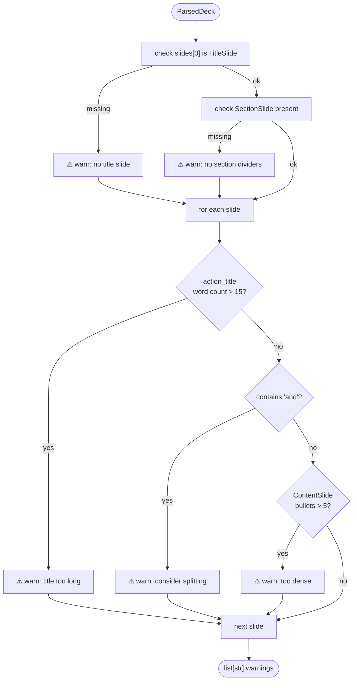
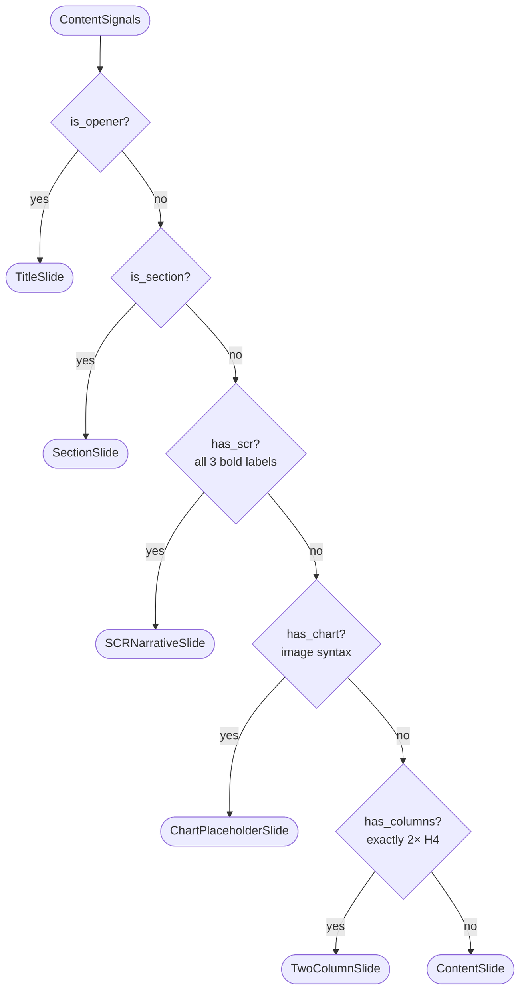

# slide-deck

Python library that converts Markdown files into LaTeX (Beamer) PDF slide decks.  
Write `.md` → get a consulting-quality PDF. No API key required.

---

## Quick start

```bash
uv add jinja2 click rich pydantic          # runtime deps
uv add --dev pytest ruff                   # dev deps
uv run main.py build examples/ml_monitoring.md
uv run main.py validate examples/ml_monitoring.md   # lint only
```

---

## How it works

### Pipeline overview



---

### 1. `parse(path)` — `slides/parser.py`

Reads a `.md` file line-by-line, maps headings to slide roles, and runs the FFT classifier on each slide body to produce fully-typed Pydantic slide objects.


**Output:** `ParsedDeck` — `title`, `author`, `theme`, `slides: list[Slide]` fully typed.

---

### 2. `validate(deck)` — `slides/api.py`

Runs the ghost-deck linter against MBB consulting standards. Never raises — always returns warnings as strings.



**Output:** `list[str]` — zero or more warning messages; empty list means deck passes.

---

### 3. `build(deck)` — `slides/api.py` + `slides/renderer.py` + `slides/compiler.py`

Renders typed slide objects to a LaTeX Beamer document, then compiles to PDF with a content-hash cache.


**Output:** `str` — absolute path to compiled PDF, e.g. `output/deck.pdf`.

---

### 4. FFT Template Classifier — `slides/selector.py`

Fast-and-Frugal Tree: checks one cue at a time, exits on first match. Most distinctive signals checked first.



**Output:** `str` — class name of the winning slide type.

---

## Markdown conventions

```markdown
# Deck Title                              ← TitleSlide
<!-- author: Name -->                     ← deck metadata
<!-- theme: consulting -->                ← see Themes table

## Section Name                           ← SectionSlide

### Slide action title                    ← ContentSlide (default)
- bullet one
- bullet two
> Source: IDC 2025

### SCR narrative title
**Situation:** current state...           ← SCRNarrativeSlide (all 3 required)
**Complication:** the problem...
**Resolution:** recommendation...

### Chart slide title
         ← ChartPlaceholderSlide

### Two-column title                      ← TwoColumnSlide (exactly 2 H4s)
#### Left Header
- left bullet
#### Right Header
- right bullet

### Three key metrics
**ARR:** $2.1M                            ← StatsSlide (≥2 non-SCR bold-key lines)
**NRR:** 94%
**CAC:** $38

### Expert validation
> "Simplicity is the ultimate sophistication."   ← QuoteSlide
> — Leonardo da Vinci

### Rollout plan
1. Phase 1: Foundation                    ← TimelineSlide (ordered list ≥2 items)
2. Phase 2: Buildout
3. Phase 3: Scale

### Today's agenda
<!-- agenda -->                           ← AgendaSlide (comment + ordered list)
1. Market Opportunity
2. Our Solution
3. The Ask

### Revenue by segment
| Segment | ARR | Growth |              ← TableSlide (markdown table)
|---|---|---|
| Enterprise | $1.4M | +67% |
| SMB | $0.5M | +23% |

### Thank You
<!-- closing -->                          ← ClosingSlide
hello@example.com
https://github.com/OrnlyP63/slide-deck

<!-- notes: presenter note here -->       ← notes field on any slide
```

### FFT template selection — cue order (first match wins)

| Priority | Cue | → Template |
|---|---|---|
| 1 | index 0 or `#` H1 | `TitleSlide` |
| 2 | `##` H2 | `SectionSlide` |
| 3 | `<!-- closing -->` | `ClosingSlide` |
| 4 | `<!-- agenda -->` | `AgendaSlide` |
| 5 | all 3 `**S/C/R:**` labels | `SCRNarrativeSlide` |
| 6 | `> "quote..."` blockquote | `QuoteSlide` |
| 7 | ≥2 `**Label:** Value` (non-SCR) | `StatsSlide` |
| 8 | `` image | `ChartPlaceholderSlide` |
| 9 | ordered list ≥2 items | `TimelineSlide` |
| 10 | exactly 2× `####` H4 | `TwoColumnSlide` |
| 11 | markdown table present | `TableSlide` |
| 12 | default | `ContentSlide` |

---

## Usage modes

### CLI

```bash
uv run main.py build deck.md
uv run main.py build deck.md --theme minimal --engine lualatex
uv run main.py validate deck.md
```

### Python / PydanticAI agent

```python
from slides.api import parse, validate, build

# Direct
deck = parse("deck.md")
warnings = validate(deck)
pdf_path = build(deck)

# One-shot
from slides.api import build_from_md
pdf_path = build_from_md("deck.md")

# PydanticAI tools
from pydantic_ai import Agent
from slides.api import parse, validate, build
from slides.model import ParsedDeck

agent = Agent("claude-sonnet-4-6", ...)

@agent.tool
def parse_markdown(ctx, md_path: str) -> ParsedDeck:
    return parse(md_path)

@agent.tool
def validate_deck(ctx, deck: ParsedDeck) -> list[str]:
    return validate(deck)

@agent.tool
def build_deck(ctx, deck: ParsedDeck) -> str:
    return build(deck)
```

---

## Testing

```bash
uv run pytest                          # all tests
uv run pytest tests/test_parser.py -v  # parser only
uv run pytest tests/test_selector.py   # FFT only
uv run pytest tests/test_api.py        # api only
uv run pytest tests/test_themes.py     # compile all 10 themes
```

Tests cover all 12 slide types, 10 themes, parser conventions, FFT priority, and API end-to-end.

---

## Themes

Each theme uses a community Beamer `.sty` file from CTAN/TeX Live — not just color overrides.

| Name | Audience | Beamer engine | Colors |
|---|---|---|---|
| `consulting` | Strategy / MBB pitch | [Metropolis](https://github.com/matze/mtheme) + Fira Sans | Navy `#003366`, Gold `#C9A84C` |
| `startup` | VC / Series A–B pitch | [Trigon](https://ctan.org/pkg/beamertheme-trigon) light | Orange `#FF6B35`, Teal `#00D4AA` |
| `academic` | Research / university | [Metropolis](https://github.com/matze/mtheme) + Palatino serif | Burgundy `#5C1A1A`, Gold `#8B6914` |
| `finance` | Banking / PE / hedge fund | [Focus](https://github.com/pcafrica/focus-beamertheme) | Forest green `#1B4332`, white bg |
| `tech` | Engineering / SaaS / cloud | [Metropolis](https://github.com/matze/mtheme) + Fira Sans | Deep blue `#0F4C81`, Cyan `#00B4D8` |
| `government` | Public sector / policy | [SimpleDarkBlue](https://github.com/pm25/SimpleDarkBlue-BeamerTheme) | Navy `#1C2B4A`, Red `#C0392B` |
| `healthcare` | Medical / pharma / clinical | [pure-minimalistic](https://github.com/kai-tub/latex-beamer-pure-minimalistic) | Medical blue `#005B96` accent |
| `creative` | Agency / design / media | [Trigon](https://ctan.org/pkg/beamertheme-trigon) dark | Purple `#6A0572`, Gold `#FFB703` |
| `minimal` | Any — zero distraction | [pure-minimalistic](https://github.com/kai-tub/latex-beamer-pure-minimalistic) | Default red accent, white bg |
| `dark` | Tech demo / product | [Metropolis](https://github.com/matze/mtheme) dark canvas | Dark navy `#1A1A2E`, Red `#E94560` |
